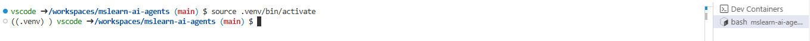
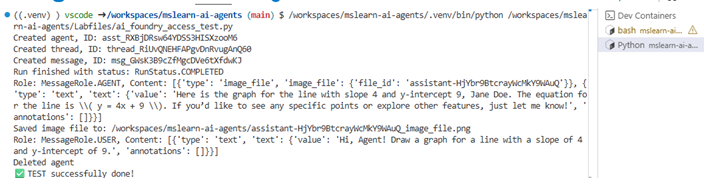

# 🧰 Prerequisites

## 0. Install Required Tools

Ensure the following tools are installed on your machine:

- **Git**  
  Download: https://git-scm.com/downloads

- **Docker Desktop**  
  Download: https://www.docker.com/products/docker-desktop

- **Visual Studio Code (VS Code)**  
  Download: https://code.visualstudio.com/Download


# 🧪 Lab Setup Steps

## 1. Clone the Repository

Open a terminal and run:

```bash
git clone https://github.com/ms-mfg-community/mslearn-ai-agents.git
cd mslearn-ai-agents
```

Open the project from VS Code or run following commnad in the `mslearn-ai-agents` folder
```bash
code .
```

This repository contains instructions and assets for building agents on Azure.

## 2. Launch Dev Container

To run the exercises in a Dev Container, follow these steps:

1. Open the repository in Visual Studio Code.
2. Press `F1` and select `Remote-Containers: Reopen in Container`.
3. Wait for the container to build and start.
> This step may take around 20 minutes based on your network speed
4. When the `postCreateCommand` is done, open a terminal in the container.
5. Start the virtual environment by running the following command:
```
source .venv/bin/activate
```
  
Result:  


### 🧭 New to Dev Containers?

This tutorial walks you through running Visual Studio Code in a Docker container using the Dev Containers extension. You need **no prior knowledge of Docker** to complete this tutorial.

Running VS Code inside a Docker container can be useful for many reasons, but in this walkthrough we'll focus on using a Docker container to set up a development environment that is separate from your local environment.

#### Prerequisites
- Visual Studio Code must be installed.

#### Install Docker
Docker is needed to create and manage your containers.

- Download and install Docker Desktop, or use an alternative Docker option like Docker on a remote host or Docker-compliant CLI.

#### Start Docker
Run the Docker Desktop application. You’ll know it’s running if you see the Docker whale icon in the activity tray.

> 🐳 If the whale icon is animated, Docker is still starting. Click the icon to check its status.

#### Check Docker
Open a terminal and run:

```bash
docker --version
```
Example output:
```txt
Docker version 18.09.2, build 6247962
```

#### Install the Extension
Install the **Dev Containers** extension in VS Code.

Once installed, you’ll see a new status bar item at the far left indicating the remote context.

Clicking this item opens Dev Containers commands.

#### Try a predefined dev container in the repo
Open the Command Palette (`F1`) → run `Dev Containers: Try a Dev Container Sample...` → select the **Node.js** sample.

> You can also try other samples like `vscode-remote-try-python` or `vscode-remote-try-java`.

#### Build the Container
VS Code will reload and begin building the container. It will clone the sample repo into an isolated container volume.

> This may take time the first time, but will be faster on subsequent launches.

Once built, VS Code connects to the container and maps your project folder into it.

#### Confirm the Container
You’ll see the remote context change in the bottom left of the status bar once connected.


## If you are not using DevContainer 3. Install Python Packages

Inside the Dev Container terminal, run:

```bash
pip install azure-ai-projects
pip install azure-identity
```


## 4. Authenticate with Azure

Use the Azure CLI to sign in to your Azure subscription:

```bash
az login
```


## 5. Set Environment Variables

To run the agent setup code, you’ll need:

- **Project Endpoint**: Found in the Azure AI Foundry portal under  
  `Azure AI Foundry (https://ai.azure.com) > Overview`.

  ⚠️ *Starting May 2025*, Azure AI Agent Service uses **project endpoints** instead of connection strings. Hub-based projects are no longer compatible with the current SDK and REST API.

- **Model Deployment Name**: Found in  
  `Models + Endpoints` in the left navigation menu of the Azure AI Foundry portal.

Set these as environment variables or keep the values:

```bash
export PROJECT_ENDPOINT="https://<your-project-endpoint>"
export MODEL_DEPLOYMENT_NAME="<your-model-deployment-name>"
```


# 🤖 Agent Setup Code

Now you’re ready to run the agent setup code.  

Replace the placeholders with your actual values:  
```bash
python Labfiles/ai_foundry_access_test.py
```

Result:  


The sample code Labfiles/ai_foundry_access_test.py  
```python
import os
from pathlib import Path
from azure.ai.projects import AIProjectClient
from azure.identity import DefaultAzureCredential
from azure.ai.agents.models import CodeInterpreterTool

project_endpoint = "{{REPLACE WITH YOUR PROJECT ENDPOINT **BUT DID YOU RUN AZCLI**}}"
model_name = "{{REPLACE WITH YOUR DEPLOYED MODEL NAME}}"

project_client = AIProjectClient(
    endpoint=project_endpoint,
    credential=DefaultAzureCredential(),
)

code_interpreter = CodeInterpreterTool()

with project_client:
    agent = project_client.agents.create_agent(
        model=model_name,
        name="my-agent",
        instructions="You politely help with math questions. Use the Code Interpreter tool when asked to visualize numbers.",
        tools=code_interpreter.definitions,
    )
    print(f"Created agent, ID: {agent.id}")

    thread = project_client.agents.threads.create()
    print(f"Created thread, ID: {thread.id}")

    message = project_client.agents.messages.create(
        thread_id=thread.id,
        role="user",
        content="Hi, Agent! Draw a graph for a line with a slope of 4 and y-intercept of 9.",
    )
    print(f"Created message, ID: {message['id']}")

    run = project_client.agents.runs.create_and_process(
        thread_id=thread.id,
        agent_id=agent.id,
        additional_instructions="Please address the user as Jane Doe. The user has a premium account",
    )
    print(f"Run finished with status: {run.status}")

    if run.status == "failed":
        print(f"Run failed: {run.last_error}")
        print("Let me try again with a different question...")
        message_2 = project_client.agents.messages.create(
            thread_id=thread.id,
            role="user",
            content="Hi, Agent! Tell me why is sky blue?",
        )
        print(f"Created message, ID: {message_2['id']}")

        run_2 = project_client.agents.runs.create_and_process(
            thread_id=thread.id,
            agent_id=agent.id,
        )
        print(f"Run finished with status: {run_2.status}")
        messages_3 = project_client.agents.messages.list(thread_id=thread.id)
        for message in messages_3:
            print(f"Role: {message.role}, Content: {message.content}")
            for img in message.image_contents:
                file_id = img.image_file.file_id
                file_name = f"{file_id}_image_file.png"
                project_client.agents.files.save(
                    file_id=file_id, file_name=file_name)
                print(f"Saved image file to: {Path.cwd() / file_name}")

        project_client.agents.delete_agent(agent.id)
        print("Deleted agent")
        print("You dont have code_interpreter but it will work for our lab ")
        print("✅ TEST successfully done!")
        # exit early
        exit(0)

    messages = project_client.agents.messages.list(thread_id=thread.id)
    for message in messages:
        print(f"Role: {message.role}, Content: {message.content}")
        for img in message.image_contents:
            file_id = img.image_file.file_id
            file_name = f"{file_id}_image_file.png"
            project_client.agents.files.save(
                file_id=file_id, file_name=file_name)
            print(f"Saved image file to: {Path.cwd() / file_name}")

    project_client.agents.delete_agent(agent.id)
    print("Deleted agent")

    print("✅ TEST successfully done!")

```
